<div align="center">

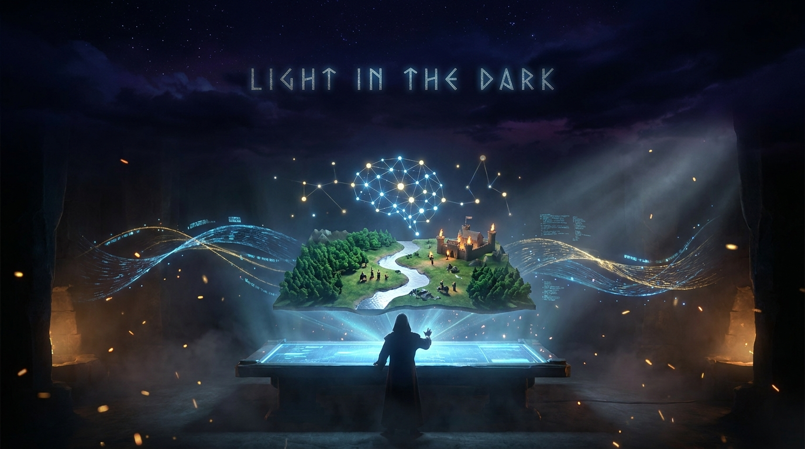

# Light in the Dark

### A no-code, AI-native game engine for building living worlds — and **Ashen Reach**, the flagship multiplayer RPG being built with it.

*Direct beautiful visual stories. Fill them with characters who are genuinely alive. Build it all without code — and let an AI build it with you. Powered by **Calyx** (grounded AI) and rendered by **g3n**, running entirely on one machine.*

</div>

---

> **Status — active development.** This README is the *vision* of what is being built, captured as a living backlog of **400+ atomic tasks**. **State lives in [GitHub Issues](../../issues)** (start at the pinned **START HERE**). Every capability shown is a tracked issue, not marketing.
>
> **Two things live here:** **① the Engine** ("Light in the Dark") — a Warcraft-III-World-Editor-class no-code creation platform; and **② the flagship Game** ("Ashen Reach") — an original, multiplayer, full-loot, roleplay-enforced RPG built *with* the engine to prove it can build anything.

---

# Part I · The Engine

## 🥇 Visual storytelling, first

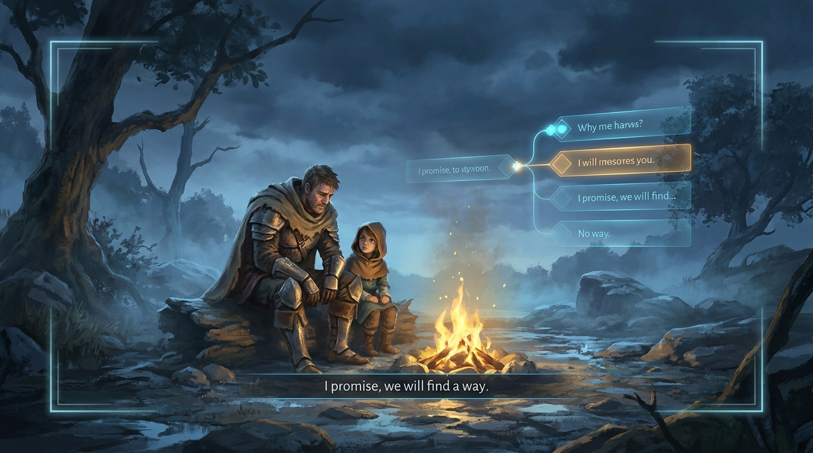

Players don't stay for stats — they stay for **emotion, character, and choices that matter.** So the whole engine is optimized to tell stories *visually*. You don't write code; you **direct scenes**: stage characters, set the mood and lighting, frame the camera, branch the dialogue, score the moment. Branching dialogue trees, cinematics, environmental storytelling, a Calyx-grounded lore bible, and an AI co-writer make telling an unforgettable story feel like play. *Show, don't tell.*

## 🛠️ The no-code editor — the World Editor, reborn

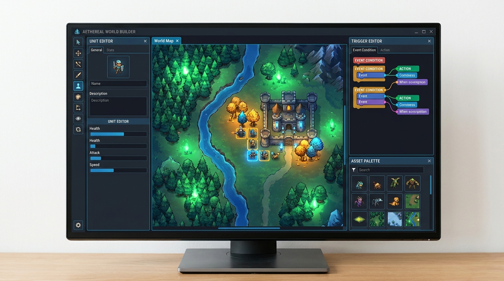

The Warcraft III World Editor was legendary because it was **opinionated and effortless**: copy a unit, tweak its stats, snap together Event → Condition → Action blocks, and you had a game. We're rebuilding that magic with modern tech. **Object Editor** (copy-paste-customize units, heroes, abilities, items), **Trigger Editor** (visual no-code logic), **Terrain Editor**, asset managers, live in-editor playtest — all WC3-simple on the surface, infinitely deep underneath. *The magic is the simplicity of piecing together an entire game.*

## 🧠 An AI builds your game — the engine *is* an MCP server

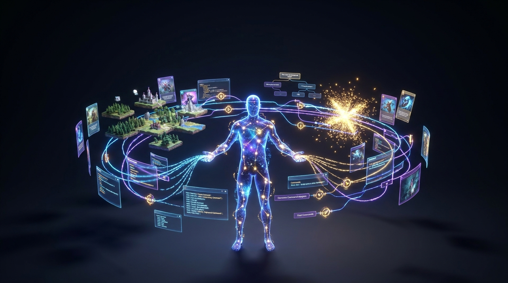

The core architectural bet: **every capability of the editor is an agent-controllable MCP tool.** The GUI and the MCP server are two faces of one capability layer. Tell an AI agent *"build a dungeon crawl with an emotional intro and a boss that taunts the party"* — and it authors the terrain, units, abilities, triggers, dialogue, VFX, and agents end-to-end, then plays it back to verify its own work. No clicking required.

## 🧠 Calyx — the living-world brain

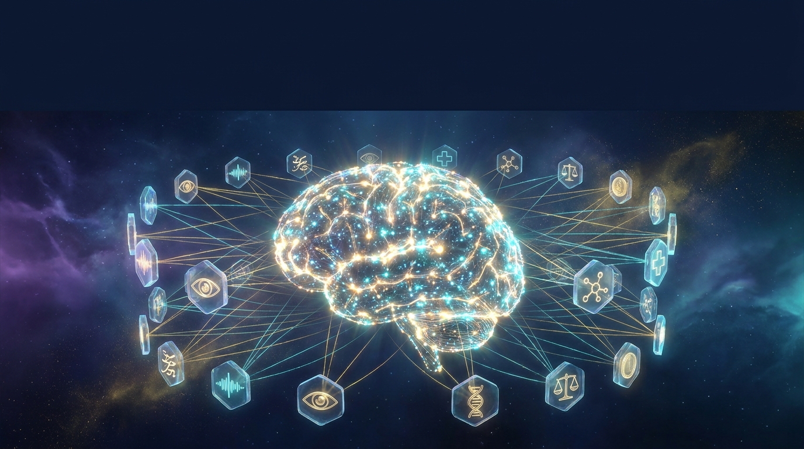

**Calyx** is a Rust grounded-association engine — an *intelligent database* that ingests everything (logs, bits, game-state signals), finds associations, and **decides when to wake and prompt the world's AI agents.** It runs locally on the RTX 5090 with **50 diverse embedder "lenses"** (image, audio, text, semantic, medical, legal, finance, code, DNA, molecule, protein) so it understands content across every modality. Crucially, Calyx keeps the AI *honest*: anything out-of-distribution — a wrong answer, impossible physics, broken behavior — **fails closed** rather than hallucinating. Its intelligence is "lowered" one-way into frozen game data, so the simulation stays bit-exact and replayable.

## 👹 Every NPC, creature, and object is alive

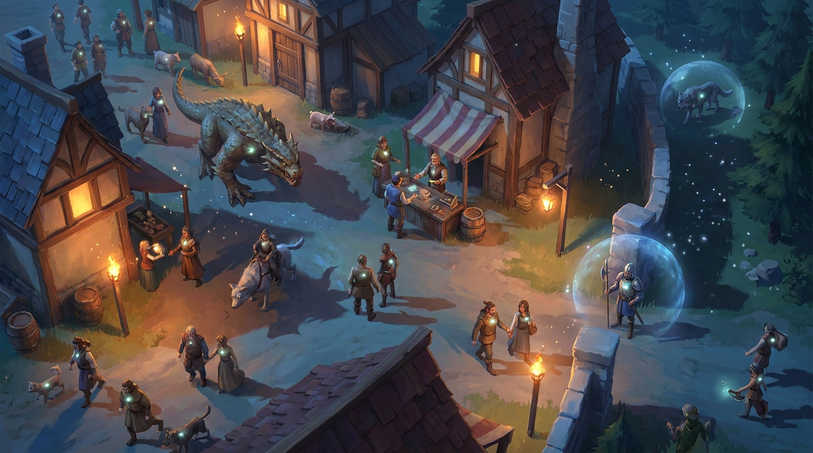

Not scripted behavior trees — **actual AI agents**, right-sized to their role: tiny ~5 MB models animate objects and particles; small local LLMs (Gemma-class 2–4B) give NPCs in-character conversation. A guardian system (**Ward**) bounds what agents may do — creative *inside* the envelope, impossible actions *refused* at the edge. Calyx decides who wakes and when, so the world feels alive whether two players or two hundred are online.

## 🎮 What your games look like

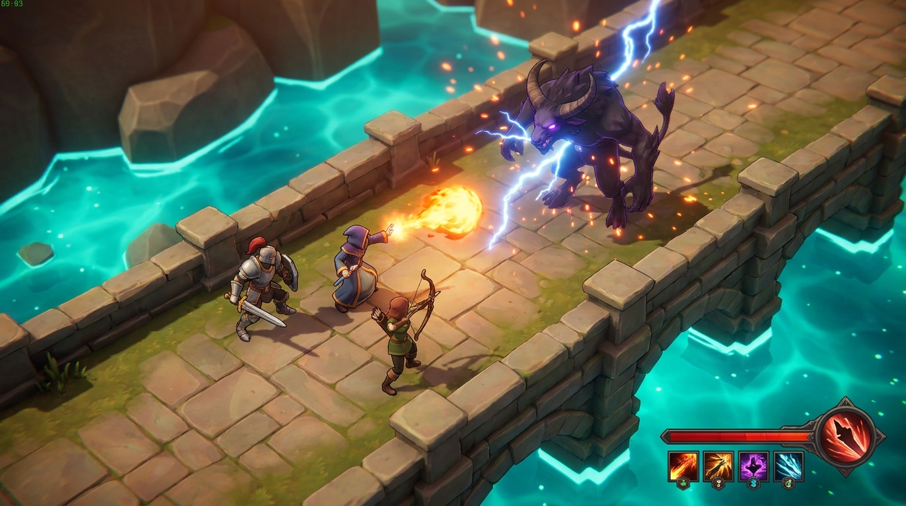

Everything is rendered by **g3n** — and **g3n generates everything**: every object, model, material, and particle is g3n-native, pushed to its high-tech ceiling on the RTX 5090. *Honest visual target:* best-in-class **stylized real-time PBR** — the look of *Sunderfolk*, *Warcraft III Reforged*, or *League of Legends*, at high framerate. Beautiful and achievable, not pre-rendered film CGI.

<table>
<tr>
<td width="50%">

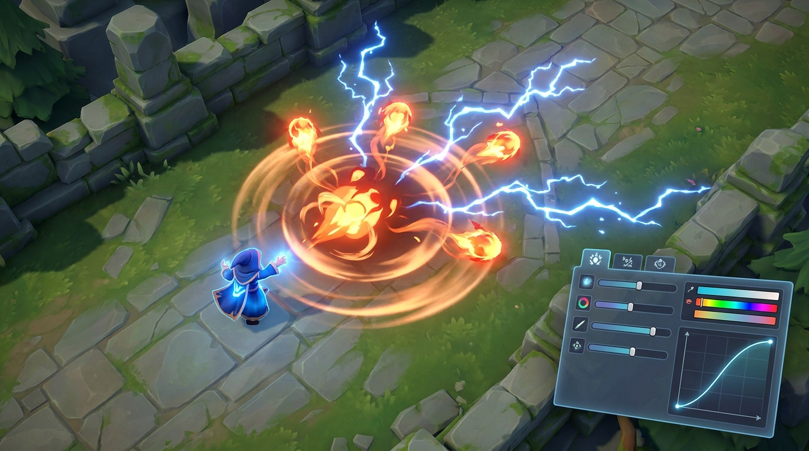
**Particles & VFX — just describe it.** Fireballs, lightning, explosions: author them with emitters and curves, or describe them in words and let Calyx generate the effect. All g3n-native, all real-time.

</td>
<td width="50%">

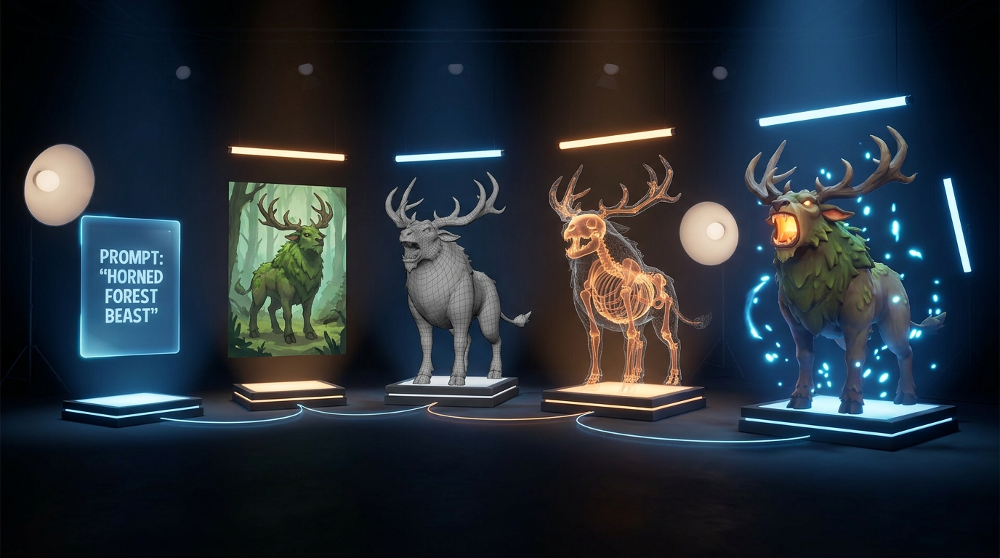
**Text → playable creature.** Describe it and watch it become real: prompt → 2D concept → 3D mesh → auto-rig → animated, game-ready model, ingested into Calyx.

</td>
</tr>
</table>

## 🏛️ Architecture — three tiers, strictly separated

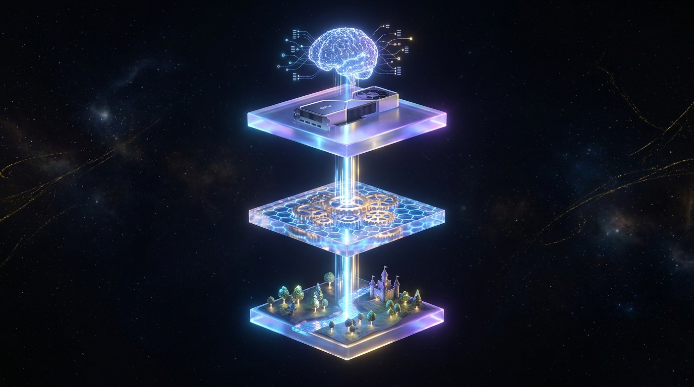

```
🧠 KNOWLEDGE / AI TIER  — Calyx (Rust, GPU) + the 50-lens brain + AI agents
        │  one-way "lowering valve"  (offline, fingerprinted)
⚙️ DETERMINISTIC SIM    — fixed-point, zero-alloc Go core   ← AI never runs here
🎨 PRESENTATION         — g3n render + audio (GPU per-frame) ← AI never in the frame
```

The AI tier is brilliant but non-deterministic; the sim core is bit-exact and replayable; the **lowering valve** is the only bridge. This is what lets a world be *alive* and *deterministic* at the same time. It all runs **locally on one workstation** — Ryzen 9 9950X3D, RTX 5090 (32 GB), 128 GB RAM — maxed out, no cloud.

---

# Part II · The World of **Ashen Reach**

*The flagship game built in the editor: an original world (working name **Ashen Reach**, realm of **Vhael**) with the systemic depth of the legendary permadeath PvP-roleplay MUDs — every name, god, faction, and tale entirely our own. In Vhael, death is permanent, and your **name** is the only thing that outlives you.*

<table>
<tr>
<td width="50%">

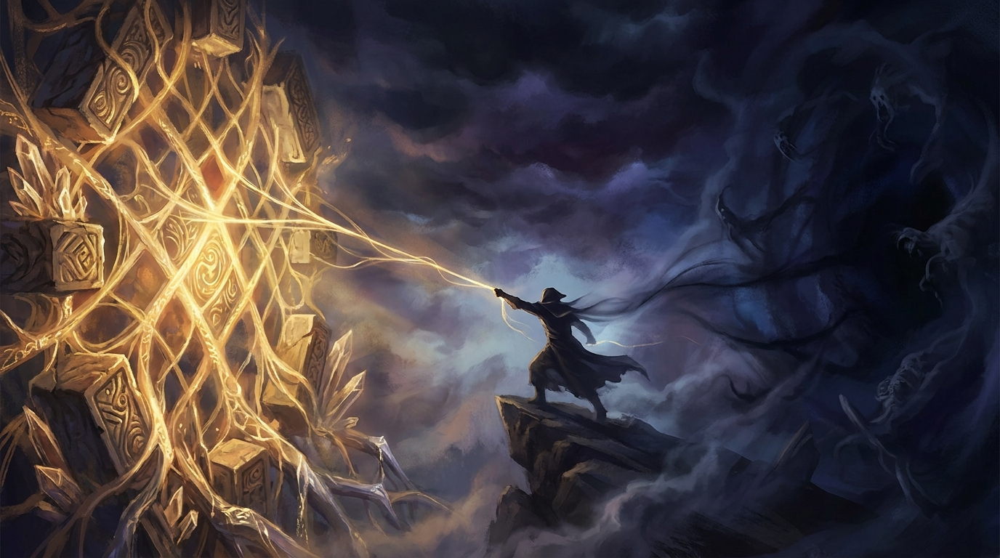
**The Weave & the Hollow.** Vhael hangs between the **Weave** — the lattice of living order — and the **Outer Dark**, a starless beyond where hungry things drift. Magic is *reaching*: pull a thread of the Weave, or open a seam to the Hollow and let something answer.

</td>
<td width="50%">

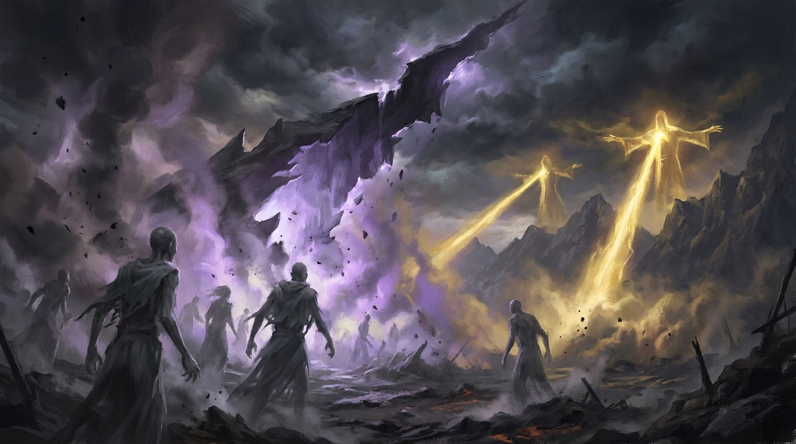
**The Sundering.** Ages ago, pact-makers tore a seam to the Hollow seeking deathless power. The dead walked; provinces were unmade; the gods spent their strength to seal it — and grew distant, working now through mortal servants.

</td>
</tr>
<tr>
<td width="50%">

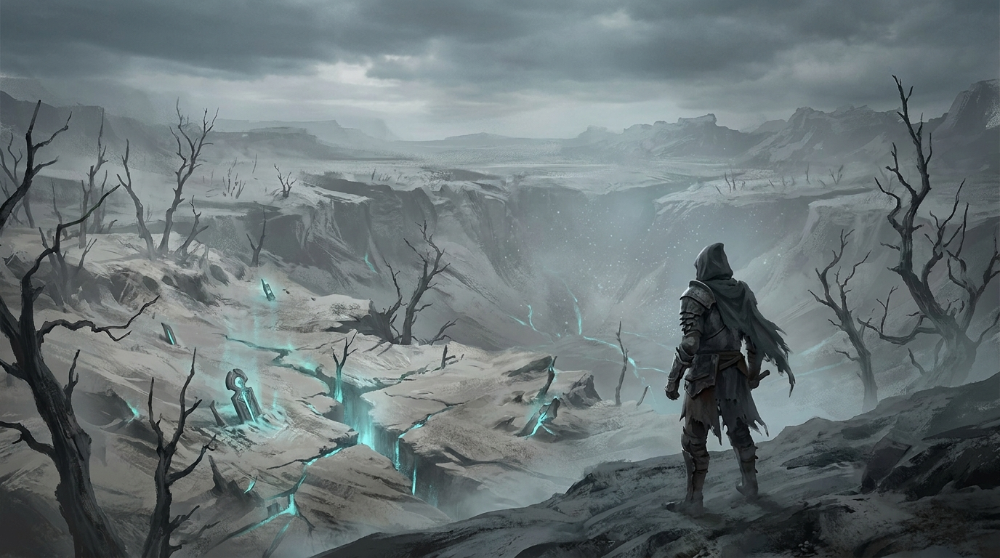
**The Ashen Reach.** The scar of the Sundering: a grey, half-real wilderness where the Weave is thin and the Hollow leaks through. Magic is cheap and dangerous here, the monsters worst — and the rarest relics in the world wash up at the edge of nothing.

</td>
<td width="50%">

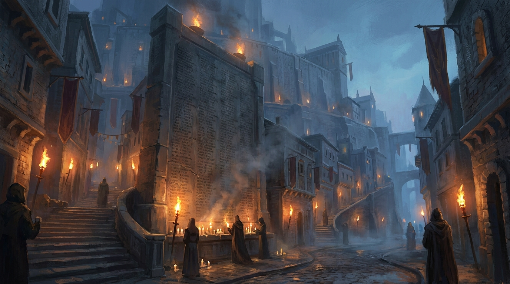
**Galdmere & the Mourning.** The great free city, neutral crossroads of the realm. At its heart stands the **mourning-wall**, carved with the names of the remembered dead. You do not play to win — you play to be *remembered*.

</td>
</tr>
</table>

## ⚡ The Seven Gods of Vhael

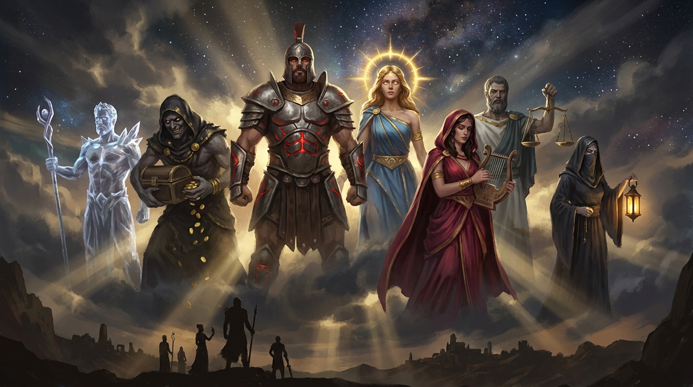

Seven gods watch over Vhael. They rarely act directly — they work through sworn mortals, granting **supplications** to priests who prove their devotion through roleplay. A god may favor you with power, or forsake you for betraying their nature.

<table>
<tr>
<td width="33%">

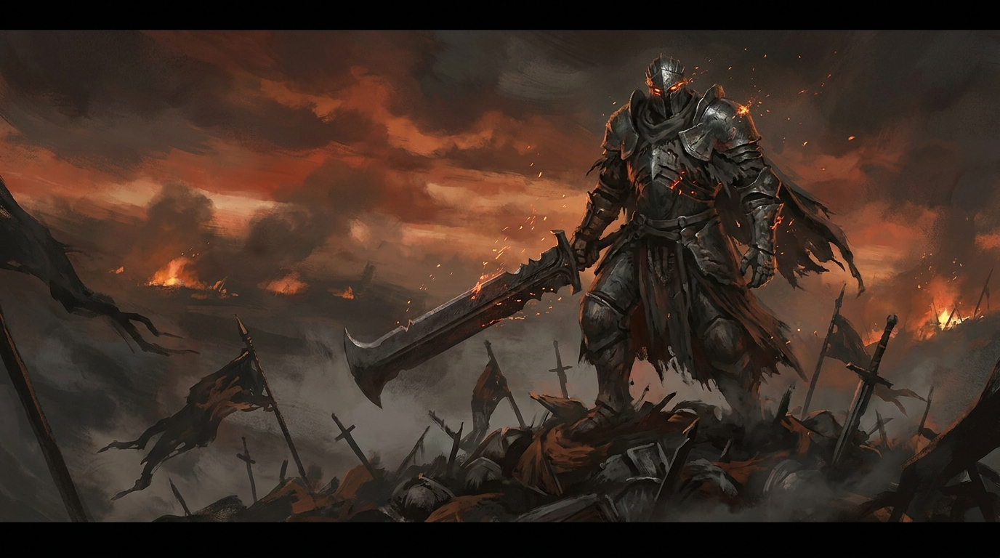
**Korthac, the Unbroken** — War, Combat, Victory. Honors strength tested; scorns the unblooded.

</td>
<td width="33%">

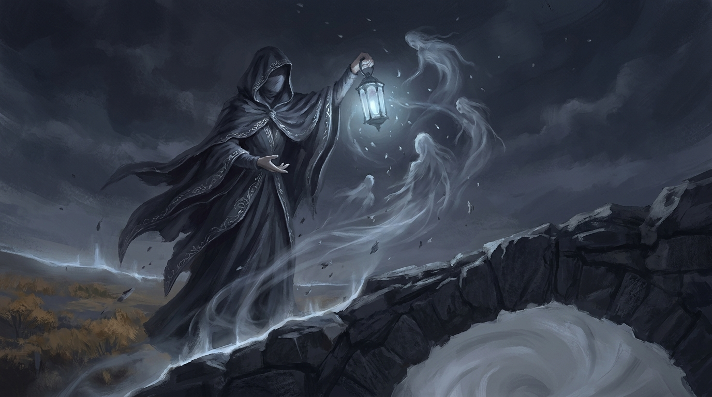
**Mphirae, the Last Veil** — Death, Shadow, Secrets. Keeper of the mourning and the door to the Hollow. Neither cruel nor kind — only final.

</td>
<td width="33%">

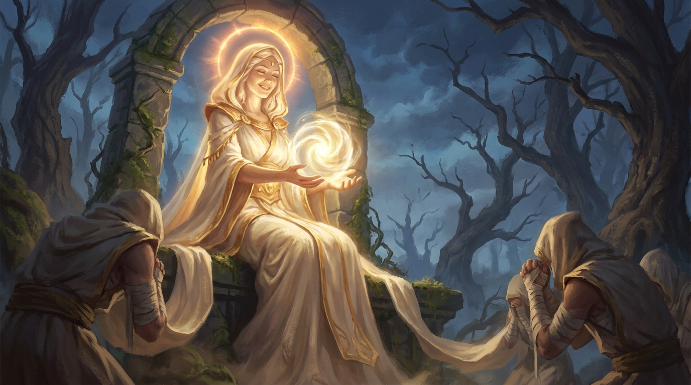
**Aelinor, the Mended Hand** — Healing, Reason, Revelation. A light that questions as well as comforts.

</td>
</tr>
<tr>
<td width="33%">

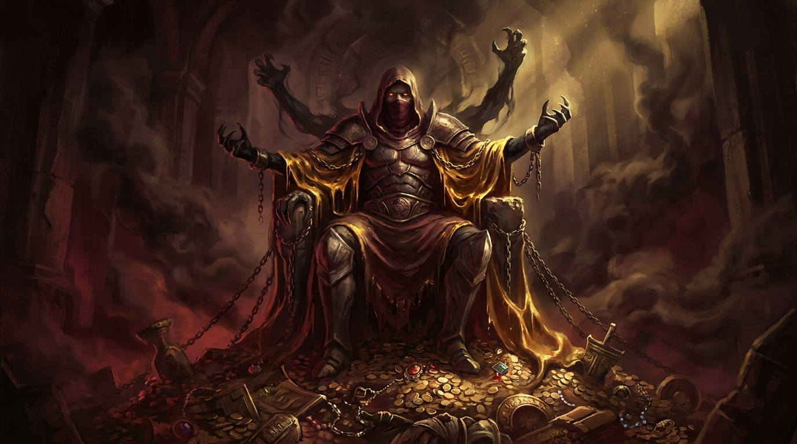
**Skarn, the Open Maw** — Greed, Envy, Wrath. Promises everything, keeps nothing.

</td>
<td width="33%">

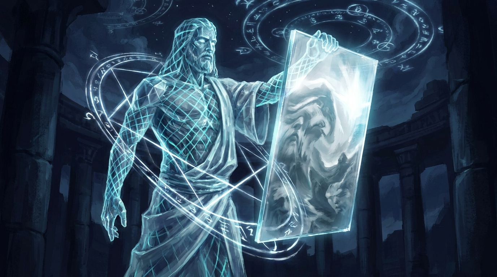
**Vessimir, the Clear Glass** — Magic, Truth, Honesty. The Weave made conscience.

</td>
<td width="33%">

*…and **Whisanne** (Passion, Courage, Wisdom) and **Orthuun** (Order, Dedication, Judgment) complete the seven.*

</td>
</tr>
</table>

## ⚔️ The Seven Factions

*Player-run orders, each sworn to a cause. Join one, rise through its ranks by roleplay, and wage war for its survival. Membership is lifelong; betrayal is costly.*

<table>
<tr>
<td width="50%">

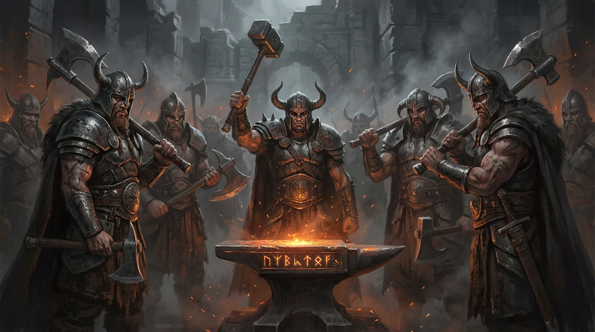
**The Ironbound** *(Any)* — a brotherhood of warriors who **despise magic** and believe the Weave should be fought, not wielded. Lead them as the **Warmaster**.

</td>
<td width="50%">

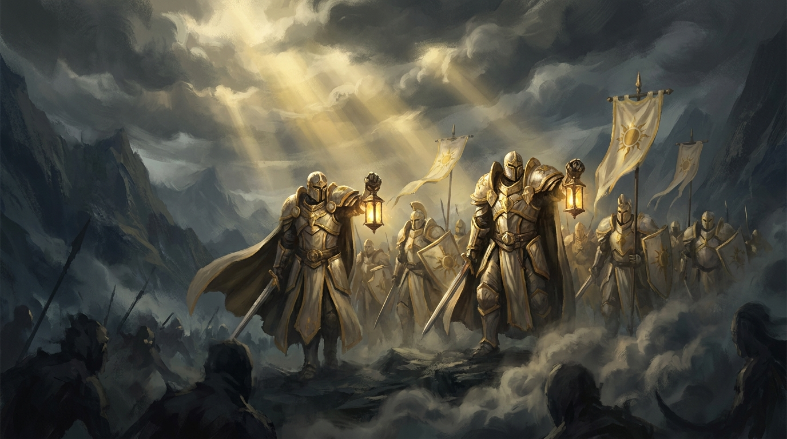
**The Dawnward** *(Good)* — knights and clerics holding the line against the Hollow's corruption. Lead as the **High Lantern**.

</td>
</tr>
<tr>
<td width="50%">

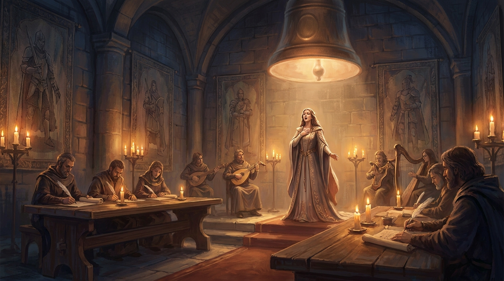
**The Vesper Court** *(Any)* — keepers of song, story, and memory. They decide who is *remembered*. Lead as the **First Voice**.

</td>
<td width="50%">

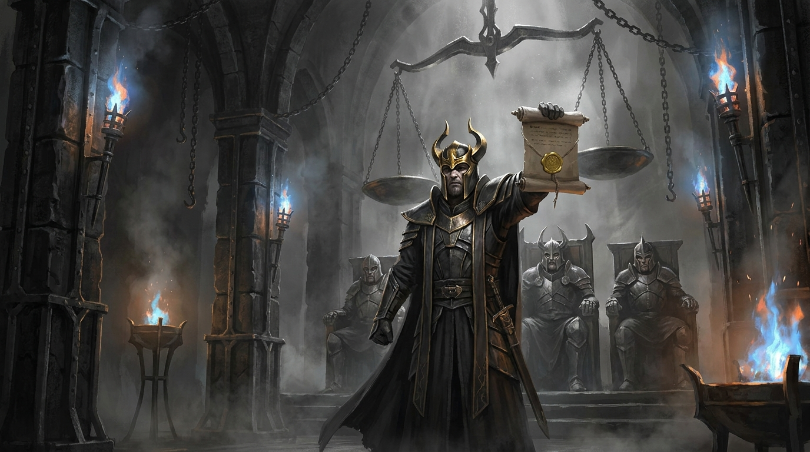
**The Iron Verdict** *(Orderly)* — judges who impose law on a lawless realm. Lead as the **Magistrate**.

</td>
</tr>
<tr>
<td width="50%">

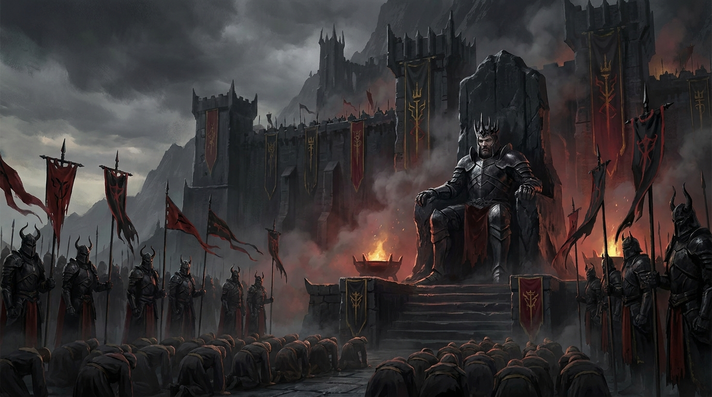
**The Onyx Dominion** *(Evil/Orderly)* — an empire that would rule all Vhael by iron and fear. Its throne, the **Sovereign**, is earnable — climb the ranks and become emperor.

</td>
<td width="50%">

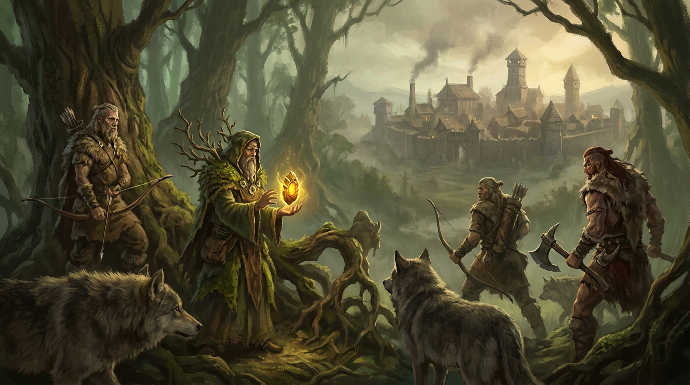
**The Thornwild** *(Neutral/Chaotic)* — wild folk and druids who would see civilization swallowed by root and storm. Lead as the **Greenfather**.

</td>
</tr>
<tr>
<td colspan="2">

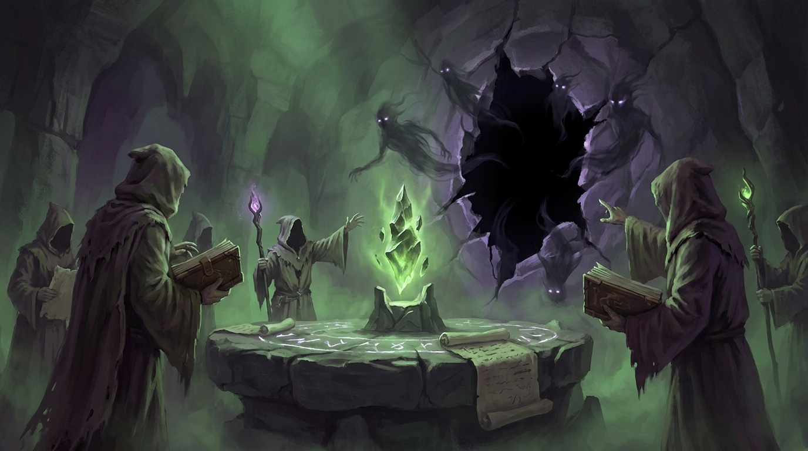
**The Hollow Pact** *(Evil)* — scholars and cultists who bargain with the beings of the Outer Dark for power no one should hold. Lead as the **Chancellor of the Veil**.

</td>
</tr>
</table>

### 🏴 Item-of-power warfare

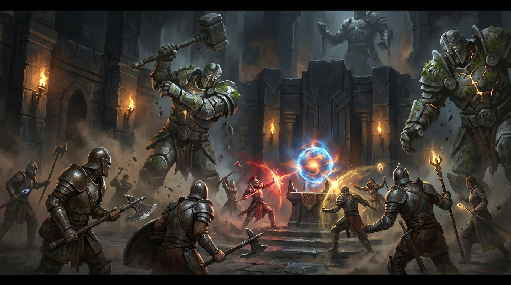

Every faction's power flows from a single **item-of-power**, guarded by Inner and Outer guardians in its hideout. **Steal a rival's item** and carry it to your shrine, and *their members lose their powers* until they take it back. This drives perpetual, high-stakes **raiding warfare**, shifting alliances, and faction politics — the endgame of Vhael. Cabal powers unlock by rank; rank is earned by roleplay.

### 🐉 Legends of the Reach

<table>
<tr>
<td width="50%">

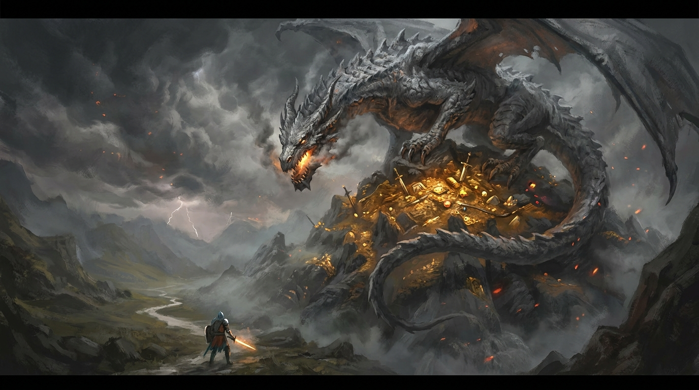
**The Ashen Dragons** of Drakemarch — eldest and most feared of monsters, scaled in grey Reach-ash, each hoarding **legendary relics** torn from the Sundering. To slay one is to be sung of for an age.

</td>
<td width="50%">

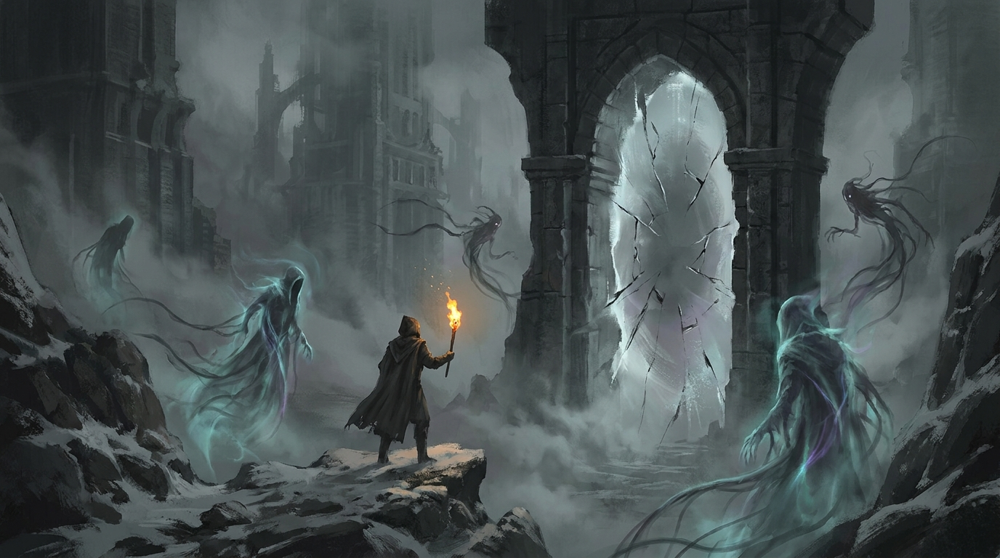
**The Hollow's Children** — silent veil-walkers and hungering grey things that seep through thin places in reality. Near the Reach, the dark gets very close.

</td>
</tr>
</table>

---

# Part III · How You Play

<table>
<tr>
<td width="50%">

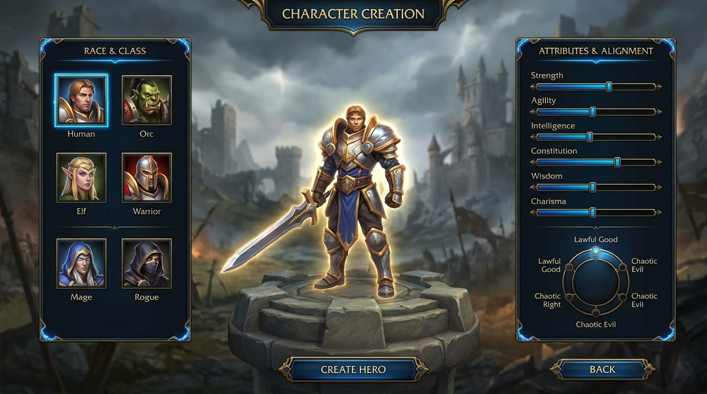
**Create your character.** Pick from generic fantasy races (human, elf, dwarf, orc, gnome…) and class archetypes (warrior, mage, thief, cleric, ranger, necromancer…), roll your six attributes, and choose your alignment and ethos. No two characters need ever be alike.

</td>
<td width="50%">

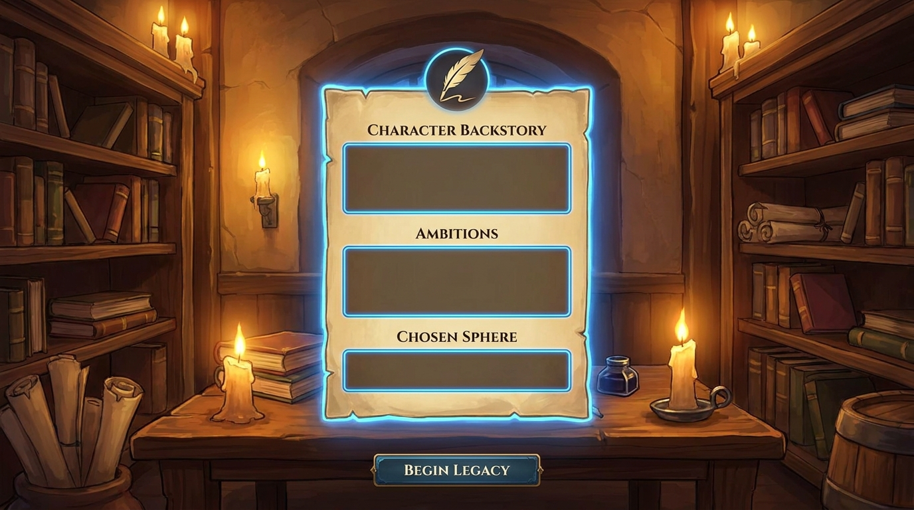
**Write your role.** Who are you? What drives you? Compose your character's backstory and ambition. In Vhael, **roleplay is required and enforced** — and how well you live your role is how you *grow*.

</td>
</tr>
<tr>
<td width="50%">

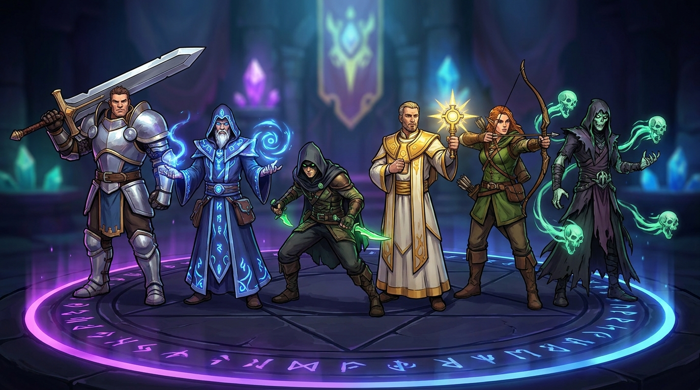
**17 classes, deep specialization.** Warriors master weapons and gain fearsome signature techniques; mages bend the elements, the body, or summon the dead; priests earn divine power through devotion; thieves brew poisons and set traps. Each branches into specializations and paths.

</td>
<td width="50%">

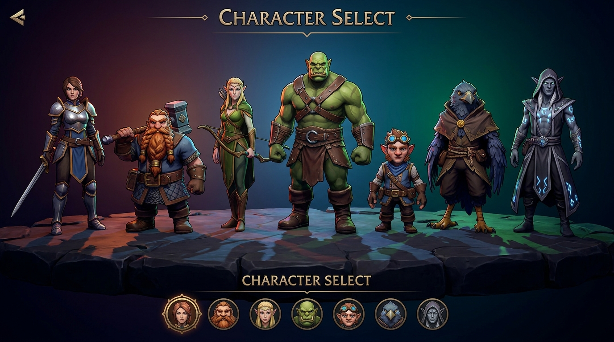
**A realm of peoples.** Generic kindreds plus original ones — the wind-born **Sylphkin**, the grey Hollow-touched **Ashkin**. Each has its own stat tendencies, resistances, innate gifts, and place in the world.

</td>
</tr>
<tr>
<td width="50%">

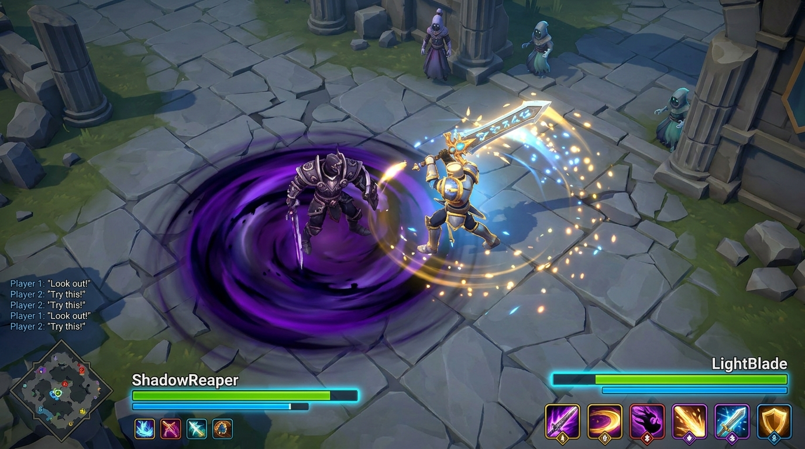
**PvP, full loot.** This is a multiplayer world from day one. You can kill anyone — and killing a player lets you **loot everything they carry**. Common gear is unlimited so you can re-equip and get back in. The rarest relics are finite in the whole world, decay if hoarded, and can only be taken by force.

</td>
<td width="50%">

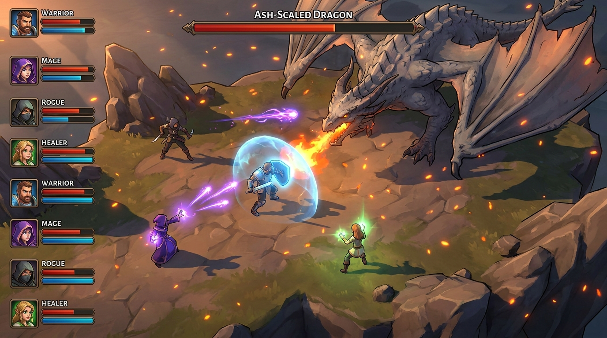
**Face the eldest things.** Party up to challenge the Ashen Dragons and the horrors of the Reach for the realm's greatest relics — powers like stone skin that, stacked, make you nigh-unkillable, and the most hunted soul in Vhael.

</td>
</tr>
</table>

### 🎭 Roleplay *is* progression — and the Immortals are watching

Calyx measures how well you embody your race, class, faction, and god — and **good roleplay advances your rank and unlocks new powers**, while **bad roleplay is punished**. The gods and faction leaders are played by **AI agents and human admins, seamlessly** — a single Immortal like the war-god Korthac might be driven by AI one hour and a human admin the next, granting boons, tattoos, titles, and rulings to those who earn them. Skill in combat and PvP is rewarded too.

### 🌍 Multiplayer, self-hosted, dead-simple

Anyone can **host a world on their own machine** — up to ~500 players — and friends connect over **localhost, LAN, an SSH tunnel, or a direct invite**. Server admins get full control: who may play, how strictly roleplay is watched, how richly it's rewarded. **The benchmark for success: the entire world runs on one personal computer** — which means anyone can host it for everyone else.

---

# Part IV · The Road Ahead

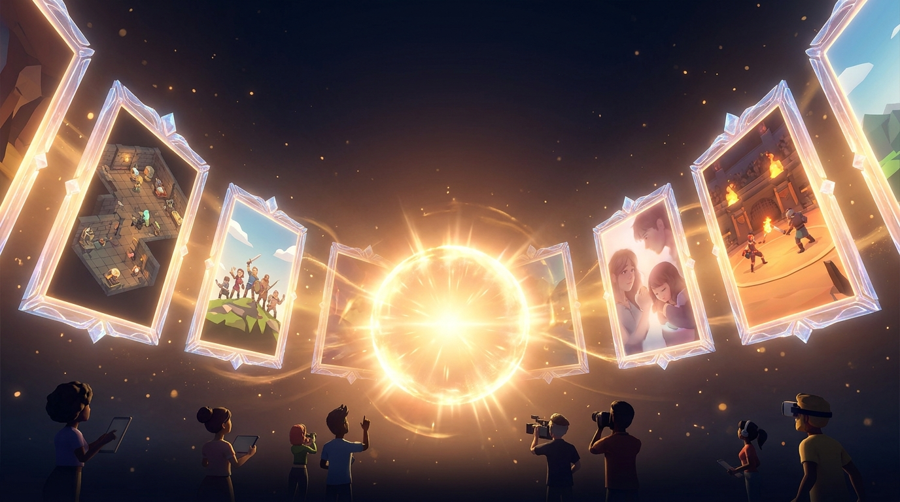

**The end goal:** build *Ashen Reach* — an original RPG world with the depth of a 30-year MUD, rendered beautifully, with AI running every god, faction, and NPC. When the engine can build *that*, it can build anything — and every other kind of game becomes a small feature add-on.

This is the most ambitious no-code game creator ever attempted: **the depth of a classic MUD, the accessibility of the Warcraft III editor, the beauty of a modern real-time engine, and the soul of an AI that brings every world to life.**

**What will you build?**

---

<div align="center">

*Light in the Dark · the world of Ashen Reach*
**By what name do you wish to be remembered?**

**[📋 Browse the 400+ issue backlog →](../../issues)** · Built with Calyx + g3n · Windows · RTX 5090

</div>
